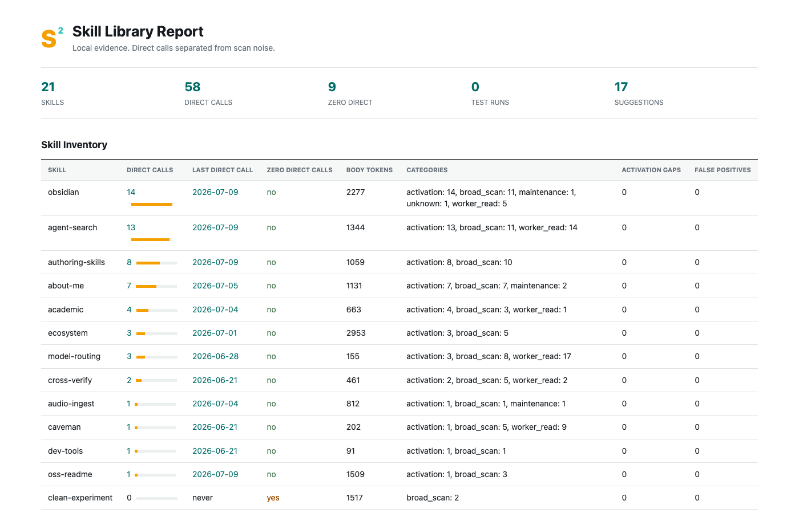

<p align="center">
  
</p>

<h1 align="center">Skill2</h1>

<p align="center"><strong>Skills for your skills.</strong></p>

<p align="center">
  An installable skill library that teaches agents to build, test, package, publish, audit, prune, and visualize other skill libraries.
</p>

<p align="center"><a href="README.zh.md">中文</a></p>

<p align="center">
  
  
  
  
</p>

<p align="center">
  
</p>

## Install

```bash
git clone https://github.com/MisterBrookT/skill2.git ~/.skill2 && ~/.skill2/install.sh
```

Installs seven Skill2 skills and the helper CLI. Requires Git and [uv](https://docs.astral.sh/uv/). Data stays local; no hosted service or telemetry. Inspect `~/.skill2/install.sh` before running it when needed.

Installer also supports `--dry-run` and conflict-gated `--force` when run from a checkout.

## Skill Library

| Skill | Agent uses it when |
| --- | --- |
| `skill2-build` | Creating or restructuring a skill. |
| `skill2-test` | Testing activation and outcome in isolation. |
| `skill2-package` | Producing an installable candidate without remote writes. |
| `skill2-publish` | Preparing README, release, and public install checks. |
| `skill2-audit` | Finding contract, safety, and behavior gaps. |
| `skill2-prune` | Reviewing keep, merge, downgrade, projectize, or delete candidates. |
| `skill2-visualize` | Viewing inventory, direct calls, zero-use candidates, and test status. |

Ask the agent directly:

```text
Build a project-level skill for this workflow, then create isolated cases.
Audit this skill library and show only evidence-backed findings.
Visualize which skills are called directly and which have zero direct calls.
```

## Local Evidence

Skill2 scans local Agent session logs for exact `SKILL.md` reads. It separates direct activation signals from broad scans, maintenance, and worker reads. APFS does not retain historical file-open counts, so Skill2 does not claim complete usage history.

Generate a self-contained report:

```bash
skill2 visualize --skills ~/workspace/my-skill-library/skills \
  --codex ~/.codex --out skill-report.html
```

Low frequency is evidence, not a deletion decision. Prune suggestions also consider tests, ownership, project boundaries, and recent use. Reports remain local and contain no prompt or transcript content.

## Helper CLI

Skills call deterministic commands when prose is not enough:

```bash
skill2 scaffold skill my-skill --description "Use when ..."
skill2 scan skills --json
skill2 lint skills --format sarif
skill2 test skills/my-skill --cases cases/my-skill.yaml --baseline --trials 3
skill2 package-check .
skill2 publish-check .
skill2 usage --skills skills --codex ~/.codex --json
skill2 visualize --skills skills --codex ~/.codex --out report.html
```

## Design

Skill2 follows a Superpowers-style shape: skills are product; CLI is support. The repository dogfoods every rule it teaches. Package never publishes. Publish requires dry-run and explicit confirmation before tag, push, release, or upload. Prune never deletes automatically.

See [product direction](docs/PRODUCT_DIRECTION.md), [roadmap](docs/ROADMAP.md), [isolated testing](docs/ISOLATED_TESTING.md), and [prior art](docs/PRIOR_ART.md).

## Development

```bash
uv sync
PYTHONPATH=src uv run python -m unittest discover -s tests
uv run ruff check .
uv run skill2 lint skills
```

MIT
